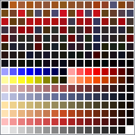

# Diablo 1 PAL File Format - Color Palettes

[1. Description](#1-description)  
[2. File structure](#2-file-structure)  
[3. `PALETTE_COLOR` (3 bytes)](#3-palette-color-3-bytes)  


## 1. Description

Diablo 1 color palettes use the `.pal` file extension.  
Color palettes are sets of 256 colors used to render CEL/CL2 graphics.

> **Example**:  
`DIABDAT.MPQ/levels/towndata/town.pal`  
This palette is used to render Tristram.  


## 2. File structure

```
PALETTE_COLOR [256 occurences]
```


## 3. `PALETTE_COLOR` (3 bytes)

```
RED_COMPONENT, GREEN_COMPONENT, BLUE_COMPONENT
```

Colors are stored as RGB 24-bit (each color is 3 bytes).  
First byte is the red color component, second green and third blue.

> **Note**: The palette file size is always 768 bytes (3 bytes * 256 colors).

When a CEL/CL2 graphics file refers to a palette color, it uses a one byte `PALETTE_INDEX` in the `[0x00, 0xFF]` range.  
This index refers to the `PALETTE_INDEX`th color in the color palette.  
To find the corresponding `PALETTE_OFFSET` in the color palette file, use the following formula:

```
PALETTE_OFFSET = 3 * PALETTE_INDEX
```
